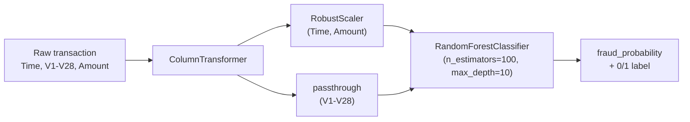

<div align="center">

  

  <br> 
  
[](https://credit-card-fraud-detection-1-1ao8.onrender.com/)
[](https://www.python.org/)
[](https://fastapi.tiangolo.com/)
[](https://scikit-learn.org/)
[](https://render.com/)
[](LICENSE)


</div>

## Table of Contents
- [Overview](#overview)
- [Results](#results)
- [How It Works](#how-it-works)
- [The Web App](#the-web-app)
- [Repository Structure](#repository-structure)
- [API Reference](#api-reference)
- [Running Locally](#running-locally)
- [Deploying to Render](#deploying-to-render)
- [Limitations](#limitations)
- [Tech Stack](#tech-stack)
- [License](#license)

## Overview

A tuned `RandomForestClassifier` that scores a credit card transaction's
fraud probability from its elapsed time, transaction amount, and 28
PCA-anonymized features (`V1`–`V28`), trained on the [Kaggle
`mlg-ulb/creditcardfraud`](https://www.kaggle.com/datasets/mlg-ulb/creditcardfraud)
dataset — 284,807 real European cardholder transactions where only **0.17%**
are fraudulent.

That imbalance is the actual problem this project is about. The model is
trained with cost-sensitive class weighting (`class_weight='balanced'`)
rather than synthetic oversampling (no SMOTE) — it learns from the real
distribution instead of a rebalanced copy of it — and it's tuned and
reported on **PR-AUC**, not accuracy, since accuracy on a 99.8%-majority
class rewards a model that just predicts "legitimate" every time.

The trained pipeline (preprocessing + model, one `joblib` artifact) is
served behind a FastAPI app: a `/predict` endpoint for programmatic use,
and a small browser UI at `/` for trying it by hand. Both run from the
same process, deployed as a single Render web service. Full methodology,
every number below, and one real deployment bug this surfaced are
documented in [`PROCESS.md`](PROCESS.md).

## Results

Held-out test set (56,962 transactions never seen during tuning, 98 of them
fraud):

| Metric (fraud class) | Score |
|---|---|
| Precision | 0.79 |
| Recall | 0.83 |
| F1 | 0.81 |
| CV PR-AUC (tuning) | 0.8205 |

In plain terms: of the transactions the model flags as fraud, ~79% are
actually fraud; of the real frauds in the test set, it catches ~83% of
them. Three models were compared before landing on Random Forest — see the
[full comparison table](PROCESS.md#5-model-selection) for Logistic
Regression and Decision Tree numbers.

## How It Works



The entire pipeline — scaler and classifier — is one serialized object, so
the API never has to replicate preprocessing logic by hand; it loads one
file and calls `.predict_proba()` on it.

## The Web App

`V1`–`V28` are PCA components with no meaning a person could type in by
hand, so the form at `/` doesn't ask anyone to invent them:

- **Load a real transaction** cycles through actual rows from the dataset
  (all legitimate — real fraud is too rare, at 0.17%, to show up in the
  first handful of rows, which is itself the whole point of the project).
- **Randomize V1–V28** fills them from the dataset's real per-feature
  spread (mean and standard deviation from `df.describe()`), clearly
  labeled as a simulated input rather than a real transaction.
- **Amount** and **Time** stay hand-editable either way, since those two
  are the fields an actual transaction record would meaningfully vary.

Submitting calls the same `/predict` endpoint documented below.

## Repository Structure

```
credit-card-fraud-detection/
├── app.py              # FastAPI app — loads the pipeline, serves the UI + /predict
├── index.html           # browser UI
├── style.css
├── script.js
├── model/
│   └── Model_Pipeline.pkl   # trained preprocessor + RandomForestClassifier
├── notebooks/
│   └── credit_card_fraud_detection.ipynb   # full training & evaluation notebook
├── requirements.txt     # pinned dependencies (see PROCESS.md #10 for why)
├── render.yaml           # Render Blueprint — one-click deploy
├── PROCESS.md            # methodology, real metrics, deployment notes
└── LICENSE
```

## API Reference

| Method | Path | Description |
|---|---|---|
| `GET` | `/` | Browser UI |
| `GET` | `/health` | JSON model-load status, used by Render's health check |
| `POST` | `/predict` | Score one transaction |
| `POST` | `/predict/batch` | Score a list of transactions |

Interactive docs (Swagger UI) are auto-generated at `/docs` once the app is
running.

<details>
<summary><strong>Example request/response</strong> (click to expand)</summary>

```bash
curl -X POST "http://localhost:8000/predict" \
  -H "Content-Type: application/json" \
  -d '{
    "Time": 94813.86, "V1": -0.0057, "V2": 0.0033, "V3": 0.0040, "V4": 0.0007,
    "V5": -0.0025, "V6": 0.0017, "V7": -0.0006, "V8": -0.0002, "V9": -0.0009,
    "V10": -0.0012, "V11": 0.0016, "V12": 0.0002, "V13": 0.0001, "V14": 0.0002,
    "V15": 0.0003, "V16": -0.0004, "V17": -0.0002, "V18": 0.0001, "V19": 0.0004,
    "V20": 0.0001, "V21": 0.0001, "V22": 0.0002, "V23": 0.0000, "V24": 0.0001,
    "V25": 0.0001, "V26": -0.0001, "V27": 0.0000, "V28": 0.0001, "Amount": 88.35
  }'
```

```json
{
  "prediction": 0,
  "label": "Legitimate",
  "fraud_probability": 0.001659
}
```

`V1`–`V28` values above sit near the dataset's column means as a runnable
illustration — they are not a real transaction.

</details>

## Running Locally

```bash
git clone <this-repo-url>
cd credit-card-fraud-detection
python -m venv venv && source venv/bin/activate   # Windows: venv\Scripts\activate
pip install -r requirements.txt
uvicorn app:app --reload
```

Visit `http://localhost:8000/` for the UI, or `/docs` for the raw API.

## Deploying to Render

1. Push this repository to GitHub.
2. On Render: **New → Blueprint**, connect the repo — `render.yaml` is
   picked up automatically.
3. Render builds with `pip install -r requirements.txt` and starts
   `uvicorn app:app --host 0.0.0.0 --port $PORT`.

On the free plan the service sleeps after 15 minutes idle; the first
request after that can take 30–60 seconds to wake it back up.

## Limitations

This is trained on one well-known benchmark dataset with anonymized PCA
features — a demonstration of the modeling and deployment pipeline, not a
production fraud system. It doesn't monitor for data drift, and `/predict`
uses the model's default 0.5 threshold (it also returns the raw
`fraud_probability` so a caller can apply their own). Details and more
caveats in [`PROCESS.md`](PROCESS.md#9-limitations--honest-caveats).

## Tech Stack

`Python` · `FastAPI` · `scikit-learn` (RandomForestClassifier, ColumnTransformer,
RobustScaler) · `pandas` / `numpy` · `joblib` · vanilla `HTML`/`CSS`/`JavaScript` · `Render`

## License

[MIT](LICENSE) © 2026 Abhishek Singh Grover

<div align="center">

**Abhishek Grover** — AI/ML Engineer

[GitHub](https://github.com/AbhishekGrover1) · [LinkedIn](https://linkedin.com/in/abhishek-grover07) · [Portfolio](https://abhishekgroverai.netlify.app) · [Instagram](https://instagram.com/abh1shekgrover)

</div>
